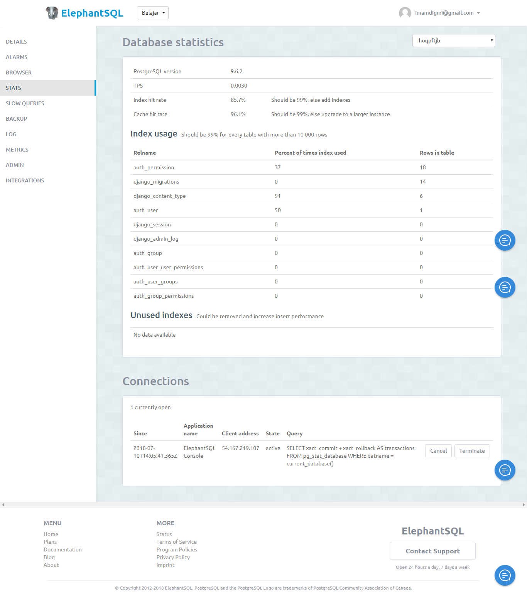

# Django + ElephantSQL
DaaS (Data as a Service) using Django and ElephantSQL demo




## Setup
Activate virtual envirounment
```bash
pipenv shell
```

Install dependencies
```bash
pipenv install
```

Migrate Schema
```bash
python manage.py makemigrations && python manage.py migrate
```

Create Superuser for accessing Django Admin
```bash
python manage.py createsuperuser
```

Sample configuration
```python
DATABASES = {
    'default': {
        'ENGINE': 'django.db.backends.postgresql_psycopg2',
        'NAME': 'database_name',
        'USER': 'database_username',
        'PASSWORD': 'database_password',
        'HOST': 'databast_host',
        'PORT': 'database_port',
    }
}
```

# Run!
```bash
python manage.py runserver
```

Navigate to [localhost:8000](http://localhost:8000)

---

# Deploy to Heroku
If you wanna deploy this simple app to Heroku, follow this step

Create Heroku instance
```bash
heroku create
```

Deploy to heroku
```bash
git push heroku master
```

Open app on heroku
```bash
heroku open
```

Or, if you wanna run locally

If you’re on Microsoft Windows system, run this:
```bash
heroku local web -f Procfile.windows
```

If you’re on a Unix system, just use the default `Procfile` by running:
```bash
heroku local web
```

Open [http://localhost:8000](http://localhost:8000) with your web browser. You should see your app running locally.

Login to admin page, navigate to [http://localhost:8000/admin](http://localhost:8000/admin) insert username and password as follow
**Username :** ayam
**Password :** ayambakar
